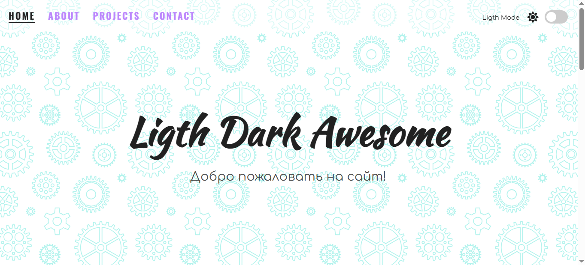
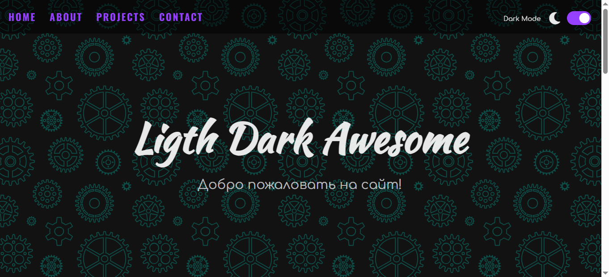
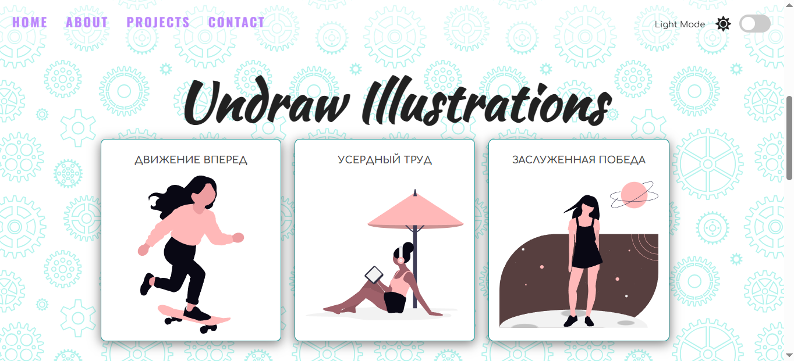
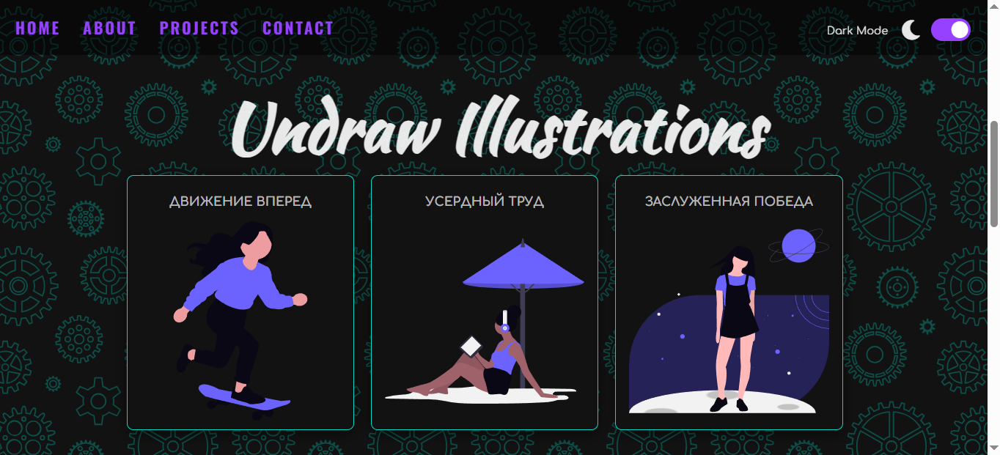
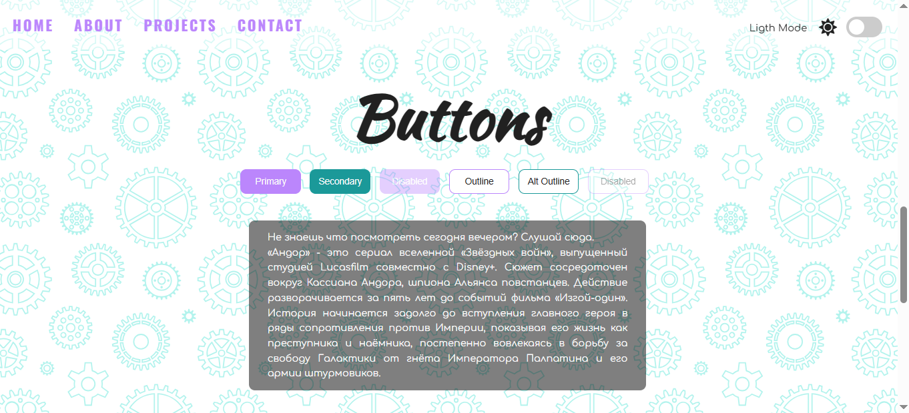
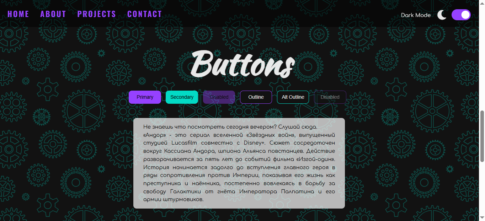
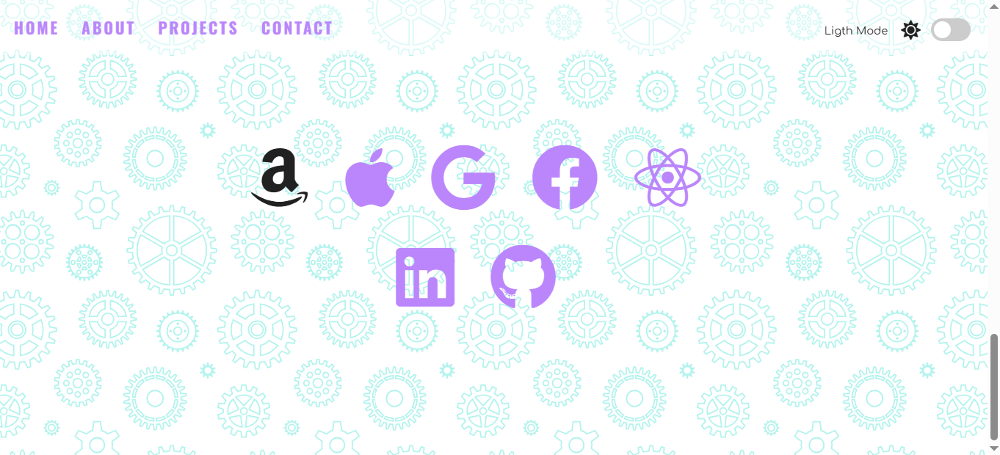
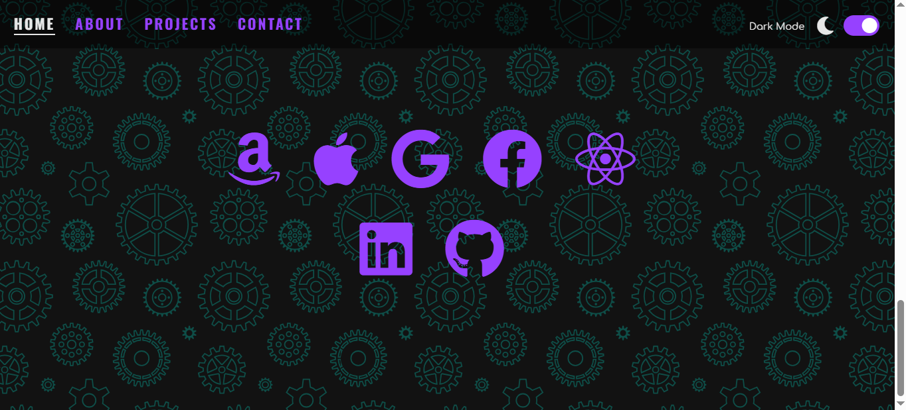

# light-dark-mode (светлый-темный режим)
Описание:  
Веб-сайт позволяет изменять темы отображения экрана со светлого на темный и обратно путем переключения соответстующего ползунка, при этом изменяются цвета фона, панели навигации, иконок и изображений в соответствии с нормами, установленными Google Material Design. 
Реализовано плавное перемещение по страницам сайта при выборе соответстующего раздела в панели навигации. 
Показаны возможности по изменению цвета как в файле CSS, так и в файле javascript. 
В CSS цвета заданы не напрямую, а путем использования переменных. 
Веб-сайт поддерживает сохранение настроек сессии при выходе из него и их восстановление при повторном посещении веб-сайта. Для этого используется local Storage (ключ-значение). 
**Страница 1 - светлая тема:**

**Страница 1 - темная тема:**

**Страница 2 - светлая тема:**

**Страница 2 - темная тема:**

**Страница 3 - светлая тема:**

**Страница 3 - темная тема:**

**Страница 4 - светлая тема:**

**Страница 4 - темная тема:**
